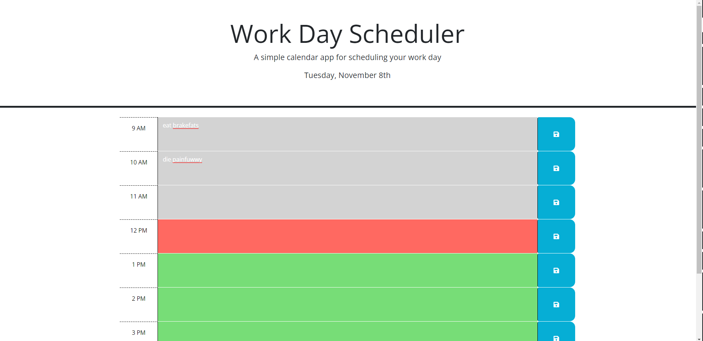

# Work-Day-Scheduler

A website app for scheduling your work day

## Description

This repo contains an app for daily work day scheduling. Users can make notes on each hour for the current work day and save those notes to the browser. Additionally, users will be able to keep track of whether the time block is the past, present, or future. This feature will especially be helpful to keep up with tasks hourly.

## Usage

This web app can be used by anyone who wishes to keep track of their workday tasks/schedule on a daily basis.

https://tessie-the-messy.github.io/Work-Day-Scheduler/

Webpage preview:

## Credits

Starter code created by: https://github.com/coding-boot-camp

## License

Please refer to the repo for licensing information.
